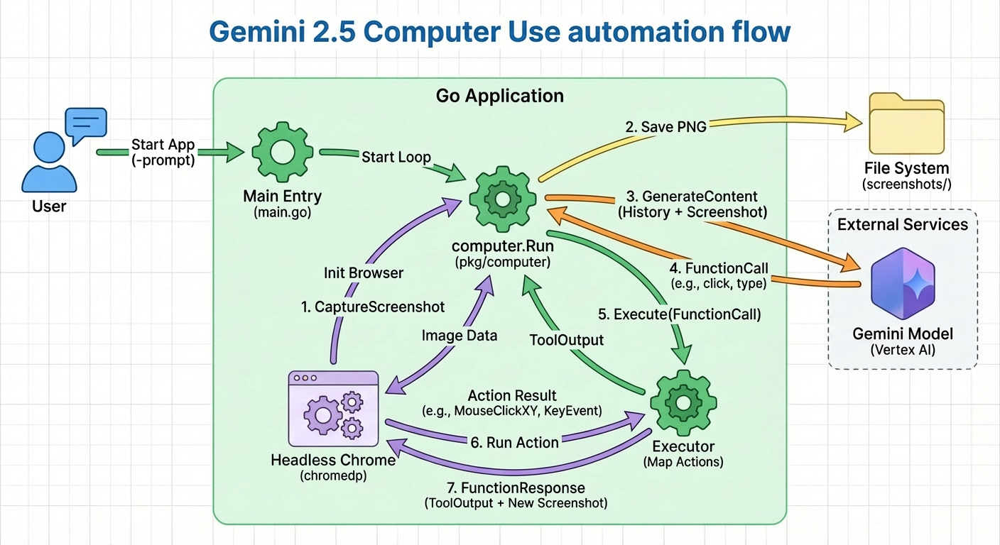

# Website Assistant: The Gemini Computer Use Framework for Go

*A foundational framework for building AI agents that see, reason, and interact with the web.*



## Overview

**Website Assistant** is a robust reference implementation and framework for the **Gemini 2.5 Computer Use** model. Built in Go, it bridges the gap between Generative AI and the browser, allowing you to build agents that can navigate websites, interact with dynamic content, and process visual information just like a human user.

While usable out-of-the-box as a general-purpose assistant, it is designed to be the **basis for specialized tools**:
*   **Visual QA Testers:** Agents that explore web apps and report visual bugs.
*   **Smart Scrapers:** Extract data from complex, Single-Page Applications (SPAs) where traditional scrapers fail.
*   **Workflow Automation:** Automate repetitive admin tasks, form filling, or "click-ops" workflows.
*   **Screenshot Services:** Intelligent capture tools that navigate to specific states before taking a picture.

## How It Works

The framework implements a continuous **Observe-Reason-Act** loop:

1.  **Observe:** `chromedp` (Headless Chrome) renders the page and captures a high-resolution screenshot.
2.  **Reason:** **Gemini 2.5 (Vertex AI)** analyzes the screenshot and conversation history to decide the next step (e.g., "I need to click the search bar").
3.  **Act:** The `Executor` translates the model's intent into low-level browser events (`MouseClickXY`, `KeyEvent`, `Scroll`).
4.  **Loop:** The result is fed back into the model, allowing for error correction and complex multi-step workflows.

## Prerequisites

*   **Go 1.25+**
*   **Google Cloud Project** with Vertex AI API enabled.
*   **Gemini 2.5 Computer Use Model** access (allowlisted or public preview).
*   **Chrome/Chromium** installed (for `chromedp`).
*   **FFmpeg** (optional, for generating session GIFs).

### Environment Variables
```bash
export GOOGLE_CLOUD_PROJECT="your-project-id"
export GOOGLE_CLOUD_LOCATION="us-central1" # Ensure model availability in this region
```

## Quick Start

### 1. General Assistant
Run the agent with a natural language prompt. It will handle the rest.

```bash
go run main.go -prompt "Go to https://google.com and search for 'Gemini Computer Use Go SDK'"
```

### 2. Visual Debugging (The "Black Box" Recorder)
Use the `-gif` flag to generate a replay of the agent's session. This is crucial for debugging *why* an agent failed or verifying a test run.

```bash
go run main.go -prompt "..." -gif
```
*Output:* `screenshots/<session-uuid>/session.gif`

### 3. Controlled Testing
The project includes a `testserver` to validate agent behavior against a controlled environment (no internet required).

```bash
# Start the local test bench
go run cmd/testserver/main.go &

# Dispatch the agent
go run main.go -prompt "Go to http://localhost:8080, enter 'Agent Smith' as the name, and click Submit." -gif
```

## Building Custom Tools

This repository is structured to be extended.

*   **`pkg/computer/computer.go`**: The "Brain". Modify this to change the prompt engineering, history management, or add system instructions.
*   **`pkg/computer/executor.go`**: The "Hands". Extend this to support custom tools (e.g., `extract_data`, `save_file`) that the model can call.
*   **`main.go`**: The "Interface". Wrap this logic into a CLI, HTTP API, or gRPC service for your specific use case.

## Artifacts & Outputs
All run data is organized by **Session UUID** in `screenshots/`:
*   `initial.png`: The starting state.
*   `turn_N_post.png`: Snapshots taken immediately after every action.
*   `session.gif`: A full video replay of the task.

## Architecture

The system follows a Client-Server-Model pattern:
*   **Client:** The Go application managing the state loop.
*   **Server:** The Browser instance (managed via `chromedp`).
*   **Model:** Vertex AI (Gemini 2.5).

**Core Packages:**
*   `google.golang.org/genai`: The official Go SDK for Gemini.
*   `github.com/chromedp/chromedp`: High-performance Chrome DevTools Protocol client.

## License
Apache 2.0
