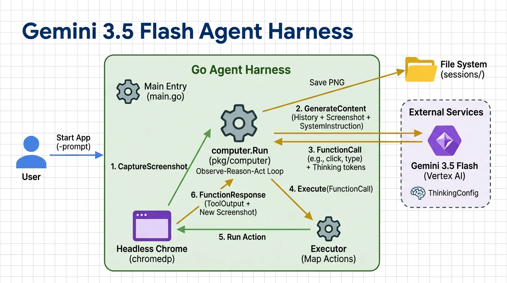

# Riptide: A Gemini 3.5 Flash Agent Harness in Go

*The scaffolding that connects Gemini 3.5 Flash's built-in computer use to a real browser — so agents can see, reason, and act on the web.*



## Overview

**Riptide** is a Go implementation of an **agent harness** for **Gemini 3.5 Flash** with its built-in computer use tool.

An agent harness is the software scaffolding around a foundation model: it determines which tools are exposed to the model, manages the observation–reason–act loop, handles context and state across turns, executes actions in the environment, and enforces safety policies. Riptide does all of this specifically for browser-based computer use — bridging Gemini's vision and reasoning to a real headless Chrome instance via `chromedp`.

While usable out-of-the-box as a general-purpose web agent, it is designed to be the **basis for specialized harnesses**:
*   **Visual QA Testers:** Agents that explore web apps and report visual bugs.
*   **Smart Scrapers:** Extract data from complex, Single-Page Applications (SPAs) where traditional scrapers fail.
*   **Workflow Automation:** Automate repetitive admin tasks, form filling, or "click-ops" workflows.
*   **Screenshot Services:** Intelligent capture tools that navigate to specific states before taking a picture.

## How It Works

The harness implements a continuous **Observe-Reason-Act** loop. Each turn, the harness is responsible for assembling the observation (screenshot + accessibility tree), managing context (history pruning), dispatching the model call, executing the returned action, and deciding when to stop.

1.  **Observe:** `chromedp` (Headless Chrome) renders the page and captures a screenshot. The Chrome Accessibility Tree is injected alongside it for semantic grounding.
2.  **Reason:** **Gemini 3.5 Flash (Vertex AI)** analyzes the observation with a `SystemInstruction`-defined agent persona. Internal chain-of-thought reasoning (`ThinkingConfig`, 8 192-token budget) improves multi-step planning on complex tasks.
3.  **Act:** The `Executor` translates the model's `FunctionCall` into low-level browser events (`MouseClickXY`, `KeyEvent`, `Scroll`), with heuristics like Euclidean Aim Assist to compensate for coordinate imprecision.
4.  **Loop:** The action result and a fresh screenshot are returned to the model as a `FunctionResponse`, driving the next turn. The harness prunes old screenshots to stay within the context window and auto-terminates on prompt injection detection.

## Prerequisites

*   **Go 1.25+**
*   **Google Cloud Project** with Vertex AI API enabled.
*   **Gemini 3.5 Flash** access via Vertex AI (generally available; no allowlist required).
*   **Chrome/Chromium** installed (for `chromedp`).
*   **FFmpeg** (optional, for generating session GIFs).

### Configuration & Environment
Riptide looks for configuration (environment variables) in the following order:
1.  **Actual Environment Variables** already set in your shell.
2.  **Local `.env` file** in the current working directory.
3.  **XDG Config:** `$XDG_CONFIG_HOME/riptide/.env` or `~/.config/riptide/.env`.

**Required Variables:**
```bash
GOOGLE_CLOUD_PROJECT="your-project-id"
GOOGLE_CLOUD_LOCATION="us-central1"
```

## Quick Start

### 1. General Assistant (Now with TUI)
Run the agent with a natural language prompt. By default, it launches a rich **Terminal UI** for real-time monitoring. The `-prompt` flag is **mandatory**.

```bash
go run main.go -prompt "Go to https://google.com and search for 'Gemini Computer Use Go SDK'"
```

### 2. Classic Logging Mode
If you prefer standard stdout logging or are running in a non-interactive environment, disable the TUI:

```bash
go run main.go -prompt "..." -tui=false
```

### 3. Visual Debugging (The "Black Box" Recorder)
Use the `-gif` flag to generate a replay of the agent's session. This is crucial for debugging *why* an agent failed or verifying a test run.

```bash
go run main.go -prompt "..." -gif
```
*Output:* `sessions/<session-uuid>/session.gif`

### 4. Web-Based Session Viewer (New!)
Browse your session history, review agent reasoning, and view high-resolution turn-by-turn screenshot galleries in a beautiful web interface.

**Build and Start:**
```bash
# 1. Build the Lit frontend
(cd frontend && npm install && npm run build)

# 2. Build the Go backend
go build -o session-viewer cmd/session-viewer/main.go

# 3. Start the viewer
./session-viewer
```
*Access:* **`http://localhost:8083`**

### 5. Controlled Testing
The project includes a `testserver` to validate agent behavior against a controlled environment (no internet required).

```bash
# Start the local test bench
go run cmd/testserver/main.go &

# Dispatch the agent
go run main.go -prompt "Go to http://localhost:8080, enter 'Agent Smith' as the name, and click Submit." -gif
```

## Supported Actions

Riptide implements **100% of the standard Gemini Computer Use toolset**, augmented with advanced heuristics for reliability and Custom Skills for deeper programmatic context.

For a comprehensive matrix of every tool, alias, and capability, see the [Riptide Tools & Skill Reference](docs/tools_reference.md).

| Action Type | Examples | Description |
| :--- | :--- | :--- |
| **Native Clicks** | `left_click`, `right_click`, `double_click` | Translates normalized model coordinates into physical CDP interactions. Employs **Euclidean Aim Assist** to snap to the nearest interactive element. |
| **Native Motions**| `scroll`, `left_click_drag`, `mouse_move` | Performs complex spatial interactions for sliders, canvas elements, and navigation. |
| **Native Inputs** | `type`, `key` | Injects text and keyboard commands. Uses **Smart JS Focus** to ensure the target input is ready. |
| **Custom Skills** | `get_page_layout`, `get_accessibility_tree`| Riptide-specific capabilities injected via a **Hybrid Tool Schema**. Gives the agent deterministic, programmable ways to interrogate the browser state. |
| **Alias Patches** | `search`, `scroll_down` | Internal interceptors that catch and map common model hallucinations (e.g. `scroll_down` -> `scroll(direction='down')`) to prevent API validation crashes. |

## Configuration Flags

| Flag | Default | Description |
| :--- | :--- | :--- |
| `-prompt` | (none) | **Mandatory**. The instruction for the agent. |
| `-tui` | `true` | Use the interactive Terminal UI. |
| `-quit-on-exit` | `false` | Automatically exit the TUI when the session finishes. |
| `-gif` | `false` | Generate a `session.gif` replay of the run. |
| `-max-turns` | `10` | Hard limit on the number of turns to prevent runaway costs. |
| `-max-screenshots` | `3` | Number of recent screenshots to keep in history context. Lower values save tokens. |
| `-sessions-dir` | `sessions` | Directory to store session logs and screenshots. |
| `-high-contrast`| `false` | Use a high-contrast theme for the TUI (improves accessibility). |
| `-user-agent` | (Chrome/macOS) | Custom User Agent string to use for the browser session. |
| `-transparent-ua`| `true` | Append Riptide identification to the User Agent (polite mode). |
| `-axt` | `true` | Capture and inject the Accessibility Tree (AXTree) for semantic reasoning. |

## Testing Scenarios
We have documented several test scenarios to validate advanced capabilities like Drag & Drop, Hover, and long-session pruning.
See [Test Scenarios](docs/test_scenarios.md) for details.

## Building Custom Tools

This repository is structured to be extended.

*   **`pkg/computer/computer.go`**: The "Brain". Controls prompt engineering, system instructions, ThinkingConfig, history management, and the prompt injection auto-detection logic.
*   **`pkg/computer/executor.go`**: The "Hands". Extend this to support custom tools (e.g., `extract_data`, `save_file`) that the model can call.
*   **`main.go`**: The "Interface". Wrap this logic into a CLI, HTTP API, or gRPC service for your specific use case.

## Artifacts & Outputs
All run data is organized by **Session UUID** in the configured sessions directory (default `sessions/`):
*   `sessions/<uuid>/session.log`: The full interaction log.
*   `sessions/<uuid>/session.gif`: A full video replay of the task (if enabled).
*   `sessions/<uuid>/screenshots/`:
    *   `turn_N_post.png`: Snapshots taken immediately after every action.
    *   `turn_N_full.png`: Full-page snapshots for debugging.

## Architecture

Riptide is structured around the six runtime responsibilities of an agent harness:

| Harness Responsibility | Riptide Implementation |
| :--- | :--- |
| **Observation** | `chromedp.CaptureScreenshot` + Accessibility Tree injection |
| **Context** | Sliding screenshot window (`pruneOldScreenshots`), full text history retained |
| **Control** | `computer.Run` loop — turn limit, hallucination interception, injection detection |
| **Action** | `Executor` — coordinate denormalization, Aim Assist, CDP dispatch |
| **State** | `chromedp` browser context — cookies, local storage, session persistence |
| **Verification** | Post-action screenshot, DOM content log, `IsToolKnown` guard |

**Core dependencies:**
*   `google.golang.org/genai` v1.62.0: Official Go SDK for Gemini (Vertex AI backend).
*   `github.com/chromedp/chromedp`: High-performance Chrome DevTools Protocol client.

## Documentation
*   [Architectural Concepts](docs/concepts.md): Deep dive into the "Browser OS" model.
*   [Lessons Learned](docs/lessons_learned.md): Solutions for coordinate drift and focus issues.


## License

Apache 2.0; see [`LICENSE`](LICENSE) for details.


# Disclaimer

This project is not an official Google project. It is not supported by
Google and Google specifically disclaims all warranties as to its quality,
merchantability, or fitness for a particular purpose.