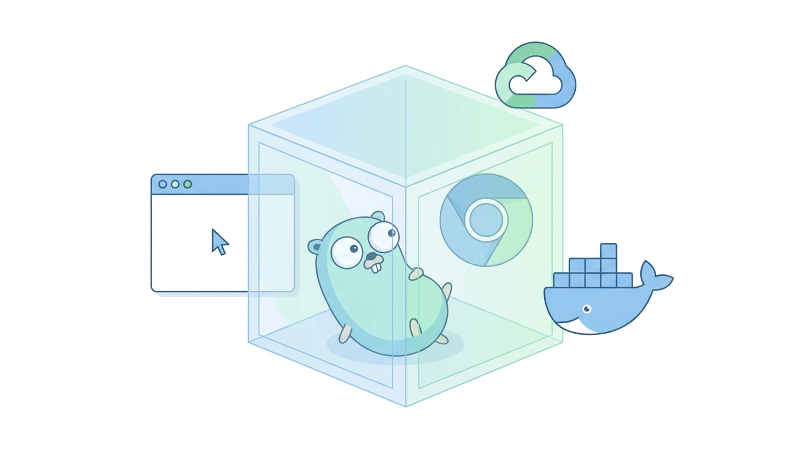
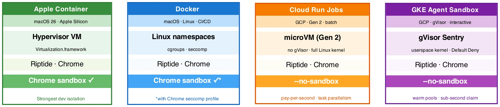
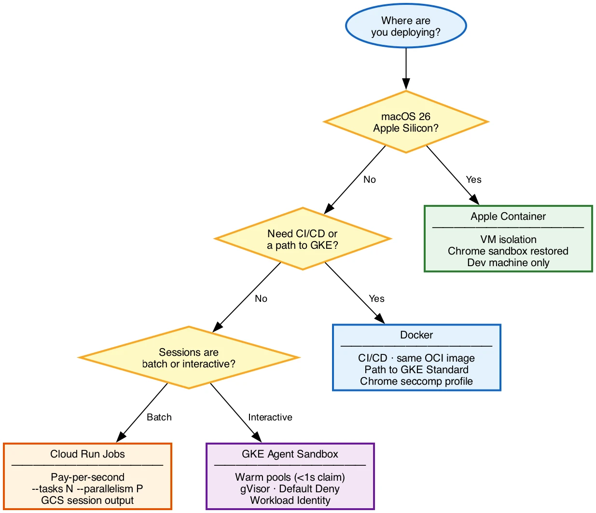
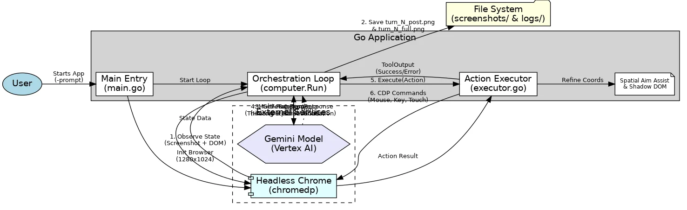

# Post 4: Sandboxing Browser Agents — Isolation Options for Go + Chrome

**Status:** Draft v1 — editorial pass applied  
**Source material:** `docs/runtime_isolation.md`  
**Target audience:** Developers deploying computer use agents beyond a single developer machine  
**Voice:** Medium / dev.to technical  
**Publication dependency:** None — can publish alongside or before Post 1  
**bd epic:** riptide-3ya

---

## Diagrams

**Header illustration:** `docs/sandboxing_header.webp` — NanoBanana-generated cover image (Go gopher inside a secure container with Chrome, Docker, and GCP icons). Use as post header on Medium/dev.to.

**Isolation stack comparison:** `docs/isolation_stack.webp` — four-column graphviz diagram showing the boundary type, Chrome internal sandbox status, and deployment context for each option. Place before the option-by-option breakdown.

**Decision flowchart:** `docs/isolation_decision.webp` — graphviz decision tree (diamond nodes: macOS 26? → CI/GKE? → batch/interactive?). Place in the "Choosing" section.

**Existing agent loop diagram:** `docs/interaction_diagram.webp` — use before the "What you're isolating" section to show what each sandbox wraps.

---



*Google's computer use docs say to run your agent in a sandboxed environment. They don't say which one, or how to handle Chrome's specific requirements in 2026. This post covers four concrete options.*

---

## There's a line in our codebase we're not proud of

```go
chromedp.NoSandbox,
```

Every Go developer who runs headless Chrome in a container has written this line. It disables Chrome's internal process sandbox. The reason is mundane — containers block the syscalls Chrome needs to sandbox its own renderer processes — but the result is real: when you run a computer use agent without this flag, Chrome crashes before the first screenshot. When you run it with this flag, Chrome's internal protection is gone.

By default, that means the model has Chrome, Chrome has your machine, and if a malicious page manipulates the model into doing something it shouldn't, the blast radius is your home directory.

The fix isn't to remove `chromedp.NoSandbox`. It's to wrap Chrome in a better boundary, one that compensates for the internal sandbox you disabled. Four options cover the full range from developer laptop to production cluster.

## What Chrome's sandbox does

Chrome's internal sandbox uses Linux namespaces and seccomp-bpf to isolate renderer processes from the OS. Each tab runs in a restricted environment where it can't write to the filesystem, open new network connections, or call dangerous kernel functions.

In a container, the default seccomp profile blocks some of the syscalls Chrome needs to set up that isolation. Chrome's response: crash. The workaround: `--no-sandbox`. The cost: renderer processes now run with the same OS access as the Chrome parent process, which runs with the same access as your Go binary, which runs with your user permissions.

That's the gap. Each of the four options below closes it differently:



## Option 1: Apple Container (macOS 26, strongest dev isolation)

Apple shipped a native container runtime at WWDC 2025. Each container is its own Linux VM, not a process inside a shared VM. The CLI is `container`, not `docker`, but it reads and writes standard OCI images.

The VM is the key detail for Chrome: inside a real Linux kernel, Chrome's internal sandbox works without modification. Remove `chromedp.NoSandbox`. Chrome sandboxes its renderers the way it does on bare metal.

```bash
container run \
  --cpus 4 --memory 4g \
  --volume $(pwd)/sessions:/sessions \
  riptide:latest \
  --prompt "Navigate to google.com" --sessions-dir /sessions
```

The same OCI image you build with Docker runs here. Isolation is at the hypervisor, not the namespace layer — an exploit inside the container has to escape Apple Virtualization.framework to reach your host.

Hard constraints: macOS 26 and Apple Silicon only. No cloud deployment path. This is a developer tool, not a production runtime. On a 16 GB Mac, plan for two to three concurrent sessions before memory becomes the limit.

## Option 2: Docker (CI/CD and path to production)

Docker is the path that works everywhere else. The two flags Chrome needs in a standard container:

```bash
docker run \
  --shm-size 2g \
  --security-opt seccomp=chrome-seccomp.json \
  --cpus 2 --memory 3g \
  --read-only --tmpfs /tmp \
  -v $(pwd)/sessions:/sessions \
  riptide:latest \
  --prompt "..."
```

`--shm-size 2g` is non-negotiable. Chrome uses `/dev/shm` for IPC between renderer processes. Docker's default is 64 MB. Chrome crashes at around 100 MB of activity, with no clear error pointing at `/dev/shm`.

`--security-opt seccomp=chrome-seccomp.json` is where the sandbox question gets resolved. The Chromium project publishes a seccomp profile that allows `CLONE_NEWUSER` — the syscall Chrome needs for its internal sandboxing — while blocking the broader dangerous surface. With that profile, you can run Chrome with its internal sandbox intact inside Docker and remove `chromedp.NoSandbox`. Without it, you keep `--no-sandbox` and let the Docker namespace be the outer boundary.

A minimal production Dockerfile:

```dockerfile
FROM debian:bookworm-slim AS builder
# ... go build -o riptide ./...

FROM debian:bookworm-slim
RUN apt-get update && apt-get install -y \
    chromium fonts-liberation libgbm1 ca-certificates \
    --no-install-recommends \
    && rm -rf /var/lib/apt/lists/*

RUN useradd -m -u 1000 riptide
USER riptide
VOLUME ["/sessions"]
COPY --from=builder /go/bin/riptide /usr/local/bin/riptide
ENTRYPOINT ["riptide"]
```

Non-root user, read-only root filesystem, explicit sessions volume. Chrome and the Go binary both run as `riptide:1000`.

Docker on macOS uses a shared Linux VM via Apple Virtualization.framework. Every Docker container on your Mac shares that kernel. Acceptable for development. In production on GKE or Cloud Run, Docker runs on native Linux and the VM layer disappears.

## Option 3: Cloud Run Jobs (batch and benchmark runs)

Cloud Run has two products. Cloud Run Services handles HTTP requests and scales to zero between them. Cloud Run Jobs runs tasks: start, execute until done, exit. Riptide's workload is a job — no HTTP server, no persistent state, just an agent loop that terminates when the task completes.

The important detail: Cloud Run Jobs always run in the Gen 2 execution environment, which uses a microVM per container instance. Gen 1 uses gVisor. For Chrome, this distinction matters significantly. In a microVM, Chrome gets a real Linux kernel. Standard container Chrome flags work. No gVisor compatibility issues.

Google explicitly documents headless Chrome via CDP as a supported Cloud Run use case. Required Chrome flags:

```go
chromedp.Flag("no-sandbox", true),           // container boundary substitutes
chromedp.Flag("disable-dev-shm-usage", true), // use /tmp, Cloud Run has no shm mount
chromedp.Flag("disable-gpu", true),
```

Session output goes to GCS via a FUSE mount at `/sessions`:

```yaml
# Cloud Run Job definition (excerpt)
spec:
  template:
    spec:
      containers:
      - image: gcr.io/PROJECT/riptide:latest
        resources:
          limits:
            cpu: "2"
            memory: 4Gi
        volumeMounts:
        - name: sessions
          mountPath: /sessions
      volumes:
      - name: sessions
        csi:
          driver: gcsfuse.run.googleapis.com
          volumeAttributes:
            bucketName: my-sessions-bucket
      serviceAccountName: riptide-sa
```

Workload Identity handles Vertex AI authentication. No API keys in the container.

The batch parallelism model fits benchmark runs directly. A 100-task MiniWob++ run with 3 seeds maps to:

```bash
gcloud run jobs execute riptide-benchmark \
  --tasks 300 --parallelism 20 \
  --args="--benchmark-manifest,gs://bucket/manifest.json"
```

Each task reads `CLOUD_RUN_TASK_INDEX` to select its prompt+seed pair from the manifest. Cost for 300 tasks at 15 minutes each, 2 vCPU: about $1.60 total.

Cold start for a container with Chromium runs 15–30 seconds. For sessions that take 5–20 minutes, that startup cost is noise. For interactive use requiring sub-second response, look at GKE Agent Sandbox.

## Option 4: GKE Agent Sandbox (interactive production)

GKE Agent Sandbox (GA on GKE ≥1.35.2) runs containers under gVisor, a userspace implementation of the Linux kernel in Go. Every syscall from the application goes to gVisor's Sentry process, which re-implements the kernel API without exposing the host kernel directly.

That's a meaningful isolation guarantee. A container exploit that would reach the host kernel through a namespace escape hits gVisor's userspace implementation instead. The attack surface shrinks from hundreds of kernel syscalls to the thirty or so gVisor needs to function.

For Chrome, the cost is real. Chrome is one of the most syscall-intensive processes in common use. gVisor intercepts every one. Screenshot-heavy agent sessions run 1.5–2x slower than in Docker. Budget for larger instance types.

Required Chrome flags under gVisor:

```go
chromedp.Flag("no-sandbox", true),            // gVisor's seccomp is incompatible with Chrome's internal seccomp-bpf
chromedp.Flag("disable-dev-shm-usage", true), // use /tmp for shared memory
chromedp.Flag("disable-gpu", true),
```

The key advantage over Cloud Run Jobs for interactive use: `SandboxWarmPool`. Keep N pods pre-initialized and ready to claim:

```yaml
apiVersion: extensions.agents.x-k8s.io/v1alpha1
kind: SandboxWarmPool
metadata:
  name: riptide-warmpool
spec:
  replicas: 5
  sandboxTemplateRef:
    name: riptide-template
```

New sessions claim a warmed pod in under a second, with Chrome already running inside. Compare that to Cloud Run's 15–30 second cold start per task. For an interactive tool where users are waiting on the first screenshot, this is the difference.

Default Deny network policy applies to sandbox pods. Egress requires explicit rules:

```yaml
networkPolicy:
  egress:
  - ports:
    - port: 443
      protocol: TCP
    to:
    - ipBlock:
        cidr: 0.0.0.0/0   # browser navigation; tighten to known Vertex AI CIDRs + allow-list
```

Workload Identity for Vertex AI auth follows the same pattern as Cloud Run.

## Choosing



These aren't mutually exclusive. The recommended stack for a GCP-native project:

| Context | Runtime | Why |
|---|---|---|
| Local dev | Docker Desktop or Apple Container | Fast feedback loop, real isolation |
| CI | Docker | Same image, predictable |
| Benchmark runs | Cloud Run Jobs | Pay-per-second, `--tasks N`, GCS output |
| Production interactive | GKE Agent Sandbox | Warm pools, Default Deny, Workload Identity |

All four use the same OCI image. Build once with Docker, run everywhere.

## What you're isolating

The diagram below shows the Riptide agent loop that runs inside each of these boundaries: the Go process managing the conversation history, the Chrome subprocess receiving CDP commands, and the Vertex AI calls carrying screenshots out and action decisions back.



Each isolation option wraps this entire stack. Chrome's CDP port (`localhost:9222`) stays on loopback inside the boundary. The only traffic that crosses the boundary outbound is HTTPS to Vertex AI and to whatever websites the agent visits. The only traffic inbound is none — no HTTP server, no open ports, no external reach into the container.

The `chromedp.NoSandbox` line in our code disables one layer of that stack's internal protection. Apple Container restores it completely. Docker restores it with a tuned seccomp profile. Cloud Run and GKE give you a different outer boundary instead. None of these is a perfect substitute for every other, but each closes the gap that running Chrome on a bare developer machine leaves open.

## The gap is a reminder, not a quirk

`chromedp.NoSandbox` exists in every Go-based browser agent because containers break Chrome's sandbox setup. The line is correct given the deployment constraints. Knowing the cost, and what each option puts back, is the point of this post.

Four options, each suited to a different point in the development and deployment lifecycle. The full architecture analysis, including gVisor benchmark data when it lands and Chrome seccomp profile sources, lives in [`docs/runtime_isolation.md`](https://github.com/ghchinoy/riptide/blob/main/docs/runtime_isolation.md).

*Riptide is open source at [github.com/ghchinoy/riptide](https://github.com/ghchinoy/riptide).*
